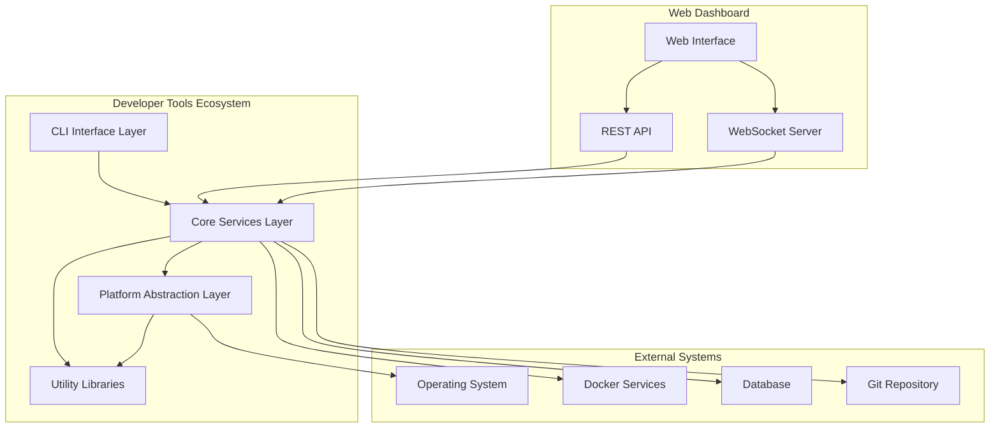

# Developer Tools Fixes and Enhancements - Design

## Overview

This design document outlines the architecture and implementation approach for
fixing critical issues in the developer tools ecosystem and implementing
advanced enhancements. The design focuses on reliability, cross-platform
compatibility, performance, and developer experience improvements.

## Architecture

### Current Architecture Issues

The current developer tools implementation has several architectural problems:

1. **Monolithic Scripts**: Large, single-purpose scripts with mixed concerns
2. **Platform Dependencies**: Hard-coded Unix commands and assumptions
3. **Poor Error Handling**: Inconsistent error handling patterns
4. **No Abstraction**: Direct system calls without abstraction layers
5. **Limited Extensibility**: Difficult to extend or modify functionality

### Proposed Architecture



## Components and Interfaces

### 1. Platform Abstraction Layer

**Purpose**: Provide cross-platform compatibility for system operations

```typescript
interface IPlatformService {
  getOperatingSystem(): OperatingSystem;
  executeCommand(command: PlatformCommand): Promise<CommandResult>;
  getProcessList(): Promise<ProcessInfo[]>;
  checkPortUsage(port: number): Promise<PortInfo>;
  findExecutable(name: string): Promise<string | null>;
}

interface PlatformCommand {
  windows?: string;
  macos?: string;
  linux?: string;
  fallback?: string;
}

enum OperatingSystem {
  Windows = 'windows',
  MacOS = 'macos',
  Linux = 'linux',
  Unknown = 'unknown',
}
```

**Implementation**:

```typescript
class PlatformService implements IPlatformService {
  private os: OperatingSystem;

  constructor() {
    this.os = this.detectOperatingSystem();
  }

  async executeCommand(command: PlatformCommand): Promise<CommandResult> {
    const cmd = this.selectCommand(command);
    if (!cmd) {
      throw new PlatformNotSupportedError(this.os);
    }

    try {
      return await this.safeExecute(cmd);
    } catch (error) {
      if (command.fallback) {
        return await this.safeExecute(command.fallback);
      }
      throw error;
    }
  }
}
```

### 2. Core Services Layer

**Purpose**: Business logic for development operations

```typescript
interface IDiagnosticsService {
  getSystemDiagnostics(): Promise<SystemDiagnostics>;
  getPerformanceMetrics(duration: number): Promise<PerformanceMetrics>;
  analyzeSystemHealth(): Promise<HealthReport>;
}

interface IServiceManager {
  listServices(): Promise<ServiceInfo[]>;
  startService(name: string): Promise<void>;
  stopService(name: string): Promise<void>;
  getServiceLogs(name: string, lines?: number): Promise<string[]>;
}

interface IEnvironmentValidator {
  validateEnvironment(): Promise<ValidationResult>;
  checkDependencies(): Promise<DependencyStatus[]>;
  generateSecrets(): Promise<GeneratedSecrets>;
}
```

### 3. Error Handling System

**Purpose**: Consistent error handling across all tools

```typescript
abstract class DevToolError extends Error {
  abstract readonly code: string;
  abstract readonly severity: ErrorSeverity;

  constructor(
    message: string,
    public readonly context?: Record<string, any>
  ) {
    super(message);
    this.name = this.constructor.name;
  }
}

class PlatformNotSupportedError extends DevToolError {
  readonly code = 'PLATFORM_NOT_SUPPORTED';
  readonly severity = ErrorSeverity.High;
}

class CommandExecutionError extends DevToolError {
  readonly code = 'COMMAND_EXECUTION_FAILED';
  readonly severity = ErrorSeverity.Medium;
}

enum ErrorSeverity {
  Low = 'low',
  Medium = 'medium',
  High = 'high',
  Critical = 'critical',
}
```

### 4. Logging System

**Purpose**: Structured logging with appropriate levels

```typescript
interface ILogger {
  debug(message: string, context?: Record<string, any>): void;
  info(message: string, context?: Record<string, any>): void;
  warn(message: string, context?: Record<string, any>): void;
  error(message: string, error?: Error, context?: Record<string, any>): void;
}

class DevToolsLogger implements ILogger {
  constructor(
    private level: LogLevel = LogLevel.Info,
    private outputs: LogOutput[] = [new ConsoleOutput()]
  ) {}

  info(message: string, context?: Record<string, any>): void {
    this.log(LogLevel.Info, message, context);
  }

  private log(
    level: LogLevel,
    message: string,
    context?: Record<string, any>
  ): void {
    if (level >= this.level) {
      const logEntry: LogEntry = {
        timestamp: new Date().toISOString(),
        level: LogLevel[level],
        message,
        context,
        tool: this.getCallerTool(),
      };

      this.outputs.forEach(output => output.write(logEntry));
    }
  }
}
```

### 5. Configuration Management

**Purpose**: Centralized configuration for all tools

```typescript
interface IConfigurationService {
  get<T>(key: string, defaultValue?: T): T;
  set(key: string, value: any): void;
  getEnvironmentConfig(): EnvironmentConfig;
  validateConfiguration(): ValidationResult;
}

interface EnvironmentConfig {
  nodeVersion: string;
  platform: OperatingSystem;
  dockerAvailable: boolean;
  databaseUrl?: string;
  redisUrl?: string;
  logLevel: LogLevel;
  toolsConfig: ToolsConfig;
}

interface ToolsConfig {
  diagnostics: {
    defaultDuration: number;
    memoryThreshold: number;
    cpuThreshold: number;
  };
  performance: {
    samplingInterval: number;
    alertThresholds: AlertThresholds;
  };
  services: {
    healthCheckTimeout: number;
    restartRetries: number;
  };
}
```

## Data Models

### System Diagnostics

```typescript
interface SystemDiagnostics {
  timestamp: string;
  system: {
    platform: string;
    arch: string;
    release: string;
    hostname: string;
    uptime: number;
    loadavg: number[];
    memory: MemoryInfo;
    cpu: CpuInfo;
  };
  node: {
    version: string;
    pid: number;
    uptime: number;
    memoryUsage: NodeMemoryUsage;
    environment: EnvironmentVariables;
  };
  dependencies: DependencyStatus[];
  services: ServiceStatus[];
  ports: PortInfo[];
  diskSpace: DiskSpaceInfo;
  issues: SystemIssue[];
}

interface MemoryInfo {
  total: number;
  free: number;
  used: number;
  percentage: number;
}

interface ServiceStatus {
  name: string;
  status: 'running' | 'stopped' | 'error' | 'unknown';
  pid?: number;
  uptime?: number;
  memoryUsage?: number;
  cpuUsage?: number;
  healthCheck?: HealthCheckResult;
}
```

### Performance Metrics

```typescript
interface PerformanceMetrics {
  duration: number;
  samples: PerformanceSample[];
  analysis: PerformanceAnalysis;
  recommendations: PerformanceRecommendation[];
}

interface PerformanceSample {
  timestamp: number;
  memory: {
    heapUsed: number;
    heapTotal: number;
    external: number;
    rss: number;
  };
  cpu: {
    user: number;
    system: number;
  };
  eventLoop: {
    delay: number;
  };
}

interface PerformanceAnalysis {
  memoryTrend: TrendAnalysis;
  cpuUtilization: UtilizationAnalysis;
  memoryLeaks: MemoryLeakDetection[];
  performanceIssues: PerformanceIssue[];
}
```

## Error Handling

### Error Classification

```typescript
enum ErrorCategory {
  Platform = 'platform',
  Configuration = 'configuration',
  Network = 'network',
  Database = 'database',
  FileSystem = 'filesystem',
  Permission = 'permission',
  Validation = 'validation',
  External = 'external',
}

interface ErrorContext {
  category: ErrorCategory;
  severity: ErrorSeverity;
  recoverable: boolean;
  userAction?: string;
  technicalDetails?: Record<string, any>;
}
```

### Error Recovery Strategies

```typescript
interface IErrorRecoveryStrategy {
  canRecover(error: DevToolError): boolean;
  recover(error: DevToolError): Promise<RecoveryResult>;
}

class CommandNotFoundRecovery implements IErrorRecoveryStrategy {
  canRecover(error: DevToolError): boolean {
    return error.code === 'COMMAND_NOT_FOUND';
  }

  async recover(error: DevToolError): Promise<RecoveryResult> {
    const alternatives = this.findAlternativeCommands(error.context?.command);
    if (alternatives.length > 0) {
      return {
        success: true,
        action: 'alternative_command',
        data: alternatives[0],
      };
    }

    return {
      success: false,
      reason: 'No alternative commands available',
      userAction: 'Please install the required tool or use manual alternatives',
    };
  }
}
```

## Testing Strategy

### Unit Testing

```typescript
// Example test structure
describe('PlatformService', () => {
  let platformService: PlatformService;

  beforeEach(() => {
    platformService = new PlatformService();
  });

  describe('executeCommand', () => {
    it('should execute Windows command on Windows platform', async () => {
      // Mock Windows environment
      jest.spyOn(os, 'platform').mockReturnValue('win32');

      const command: PlatformCommand = {
        windows: 'dir',
        linux: 'ls',
        macos: 'ls',
      };

      const result = await platformService.executeCommand(command);
      expect(result.success).toBe(true);
    });

    it('should fallback to alternative command when primary fails', async () => {
      const command: PlatformCommand = {
        windows: 'nonexistent-command',
        fallback: 'echo "fallback"',
      };

      const result = await platformService.executeCommand(command);
      expect(result.output).toContain('fallback');
    });
  });
});
```

### Integration Testing

```typescript
describe('Developer Tools Integration', () => {
  it('should complete full diagnostic workflow', async () => {
    const diagnosticsService = new DiagnosticsService();
    const result = await diagnosticsService.getSystemDiagnostics();

    expect(result.system).toBeDefined();
    expect(result.node).toBeDefined();
    expect(result.dependencies).toBeInstanceOf(Array);
    expect(result.services).toBeInstanceOf(Array);
  });

  it('should handle cross-platform service management', async () => {
    const serviceManager = new ServiceManager();
    const services = await serviceManager.listServices();

    expect(services).toBeInstanceOf(Array);
    // Test service operations on current platform
  });
});
```

### Cross-Platform Testing

```typescript
describe('Cross-Platform Compatibility', () => {
  const platforms = ['windows', 'macos', 'linux'];

  platforms.forEach(platform => {
    describe(`${platform} platform`, () => {
      beforeEach(() => {
        // Mock platform
        mockPlatform(platform);
      });

      it('should execute platform-specific commands', async () => {
        const platformService = new PlatformService();
        const command = getPlatformTestCommand(platform);

        const result = await platformService.executeCommand(command);
        expect(result.success).toBe(true);
      });
    });
  });
});
```

## Web Dashboard Architecture

### Frontend Architecture

```typescript
// React component structure
interface DashboardState {
  systemMetrics: SystemDiagnostics;
  performanceData: PerformanceMetrics;
  services: ServiceStatus[];
  logs: LogEntry[];
  alerts: Alert[];
}

// Real-time updates via WebSocket
class DashboardWebSocket {
  private ws: WebSocket;

  constructor(private onUpdate: (data: any) => void) {
    this.connect();
  }

  private connect(): void {
    this.ws = new WebSocket('ws://localhost:8080/dashboard');
    this.ws.onmessage = event => {
      const data = JSON.parse(event.data);
      this.onUpdate(data);
    };
  }
}
```

### Backend API

```typescript
// Express.js API routes
app.get('/api/diagnostics', async (req, res) => {
  try {
    const diagnostics = await diagnosticsService.getSystemDiagnostics();
    res.json(diagnostics);
  } catch (error) {
    res.status(500).json({ error: error.message });
  }
});

app.post('/api/services/:name/restart', async (req, res) => {
  try {
    await serviceManager.restartService(req.params.name);
    res.json({ success: true });
  } catch (error) {
    res.status(500).json({ error: error.message });
  }
});

// WebSocket for real-time updates
io.on('connection', socket => {
  const metricsInterval = setInterval(async () => {
    const metrics = await performanceMonitor.getCurrentMetrics();
    socket.emit('metrics', metrics);
  }, 1000);

  socket.on('disconnect', () => {
    clearInterval(metricsInterval);
  });
});
```

## Security Considerations

### Input Validation

```typescript
class InputValidator {
  static validateCommand(command: string): ValidationResult {
    // Prevent command injection
    const dangerousPatterns = [';', '&&', '||', '|', '`', '$', '(', ')', '{', '}'];$'];

    for (const pattern of dangerousPatterns) {
      if (command.includes(pattern)) {
        return {
          valid: false,
          error: 'Command contains potentially dangerous characters',
        };
      }
    }

    return { valid: true };
  }

  static sanitizePath(path: string): string {
    // Prevent path traversal
    return path.replace(/\.\./g, '').replace(/[<>:"|?*]/g, '');
  }
}
```

### Secret Management

```typescript
class SecretManager {
  static generateSecureSecret(length: number = 32): string {
    return crypto.randomBytes(length).toString('hex');
  }

  static maskSecret(secret: string): string {
    if (secret.length <= 8) return '*'.repeat(secret.length);
    return (
      secret.substring(0, 4) +
      '*'.repeat(secret.length - 8) +
      secret.substring(secret.length - 4)
    );
  }
}
```

## Performance Optimization

### Caching Strategy

```typescript
class CacheManager {
  private cache = new Map<string, CacheEntry>();

  async get<T>(
    key: string,
    factory: () => Promise<T>,
    ttl: number = 300000
  ): Promise<T> {
    const entry = this.cache.get(key);

    if (entry && Date.now() - entry.timestamp < ttl) {
      return entry.value as T;
    }

    const value = await factory();
    this.cache.set(key, {
      value,
      timestamp: Date.now(),
    });

    return value;
  }
}
```

### Parallel Execution

```typescript
class ParallelExecutor {
  static async executeInParallel<T>(
    tasks: (() => Promise<T>)[],
    maxConcurrency: number = 5
  ): Promise<T[]> {
    const results: T[] = [];
    const executing: Promise<void>[] = [];

    for (const task of tasks) {
      const promise = task().then(result => {
        results.push(result);
      });

      executing.push(promise);

      if (executing.length >= maxConcurrency) {
        await Promise.race(executing);
        executing.splice(
          executing.findIndex(p => p === promise),
          1
        );
      }
    }

    await Promise.all(executing);
    return results;
  }
}
```

## Migration Strategy

### Phase 1: Critical Fixes (Week 1)

1. Fix ESLint violations in debug-tools.js
2. Implement basic cross-platform compatibility
3. Add comprehensive error handling
4. Create platform abstraction layer

### Phase 2: Architecture Refactoring (Week 2-3)

1. Extract core services from monolithic scripts
2. Implement proper logging system
3. Add configuration management
4. Create comprehensive test suite

### Phase 3: Enhanced Features (Month 1-2)

1. Develop web-based dashboard
2. Implement advanced monitoring
3. Add automated issue detection
4. Create enhanced code generation

### Phase 4: Advanced Integration (Month 2-3)

1. CI/CD pipeline integration
2. Team collaboration features
3. Advanced analytics and reporting
4. Performance optimization and scaling

## Deployment Strategy

### Development Environment

- Local development with hot reloading
- Docker containers for consistent environment
- Automated testing on code changes

### Production Environment

- Containerized deployment
- Health monitoring and alerting
- Automated backup and recovery
- Performance monitoring and optimization

This design provides a robust foundation for fixing current issues while
enabling future enhancements and maintaining high code quality standards. for
(const pattern of dangerousPatterns) { if (command.includes(pattern)) { return {
valid: false, error: 'Command contains potentially dangerous characters', }; } }

    return { valid: true };

}

static sanitizePath(path: string): string { // Prevent path traversal return
path.replace(/\.\./g, '').replace(/[<>:"|?*]/g, ''); } }

````

### Secret Management

```typescript
class SecretManager {
  static generateSecureSecret(length: number = 32): string {
    return crypto.randomBytes(length).toString('hex');
  }

  static maskSecret(secret: string): string {
    if (secret.length <= 8) return '*'.repeat(secret.length);
    return (
      secret.substring(0, 4) +
      '*'.repeat(secret.length - 8) +
      secret.substring(secret.length - 4)
    );
  }
}
````

## Performance Optimization

### Caching Strategy

```typescript
class CacheManager {
  private cache = new Map<string, CacheEntry>();

  async get<T>(
    key: string,
    factory: () => Promise<T>,
    ttl: number = 300000
  ): Promise<T> {
    const entry = this.cache.get(key);

    if (entry && Date.now() - entry.timestamp < ttl) {
      return entry.value as T;
    }

    const value = await factory();
    this.cache.set(key, {
      value,
      timestamp: Date.now(),
    });

    return value;
  }
}
```

### Parallel Execution

```typescript
class ParallelExecutor {
  static async executeInParallel<T>(
    tasks: (() => Promise<T>)[],
    maxConcurrency: number = 5
  ): Promise<T[]> {
    const results: T[] = [];
    const executing: Promise<void>[] = [];

    for (const task of tasks) {
      const promise = task().then(result => {
        results.push(result);
      });

      executing.push(promise);

      if (executing.length >= maxConcurrency) {
        await Promise.race(executing);
        executing.splice(
          executing.findIndex(p => p === promise),
          1
        );
      }
    }

    await Promise.all(executing);
    return results;
  }
}
```

## Migration Strategy

### Phase 1: Critical Fixes (Week 1)

1. Fix ESLint violations in debug-tools.js
2. Implement basic cross-platform compatibility
3. Add comprehensive error handling
4. Create platform abstraction layer

### Phase 2: Architecture Refactoring (Week 2-3)

1. Extract core services from monolithic scripts
2. Implement proper logging system
3. Add configuration management
4. Create comprehensive test suite

### Phase 3: Enhanced Features (Month 1-2)

1. Develop web-based dashboard
2. Implement advanced monitoring
3. Add automated issue detection
4. Create enhanced code generation

### Phase 4: Advanced Integration (Month 2-3)

1. CI/CD pipeline integration
2. Team collaboration features
3. Advanced analytics and reporting
4. Performance optimization and scaling

## Deployment Strategy

### Development Environment

- Local development with hot reloading
- Docker containers for consistent environment
- Automated testing on code changes

### Production Environment

- Containerized deployment
- Health monitoring and alerting
- Automated backup and recovery
- Performance monitoring and optimization

## Success Metrics and KPIs

### Phase 1 Success Metrics

- **Code Quality**: ESLint violations reduced from 817 to 0
- **Cross-Platform Compatibility**: 95%+ success rate across Windows/macOS/Linux
- **Error Handling**: 100% coverage of critical operations
- **Tool Reliability**: 99%+ uptime for all development tools

### Phase 2 Success Metrics

- **Test Coverage**: >80% code coverage across all utilities
- **Performance**: 50%+ improvement in tool execution times
- **Security Compliance**: 100% security audit compliance
- **Developer Satisfaction**: >4.5/5 rating in developer surveys

### Phase 3 Success Metrics

- **Dashboard Adoption**: >90% of developers actively using web dashboard
- **Issue Detection**: >95% accuracy in automated issue identification
- **Automated Resolution**: >70% of common issues resolved automatically
- **Code Generation Usage**: >80% of new services use enhanced generators

### Phase 4 Success Metrics

- **CI/CD Integration**: 100% of projects using integrated pipeline tools
- **Workflow Automation**: >80% of repetitive tasks automated
- **Team Collaboration**: >95% adoption of collaborative features
- **External Integrations**: >10 third-party tools successfully integrated

### Advanced Features Success Metrics

- **Plugin Ecosystem**: >50 community-contributed plugins
- **Template Library**: >100 production-ready templates
- **AI Assistance**: >90% accuracy in intelligent recommendations
- **Performance Optimization**: 75%+ reduction in resource usage

## Risk Assessment and Mitigation

### Technical Risks

| Risk                                | Probability | Impact | Mitigation Strategy                                       |
| ----------------------------------- | ----------- | ------ | --------------------------------------------------------- |
| Cross-platform compatibility issues | Medium      | High   | Comprehensive testing matrix, platform-specific CI/CD     |
| Performance degradation             | Low         | Medium | Continuous performance monitoring, benchmarking           |
| Security vulnerabilities            | Medium      | High   | Regular security audits, automated vulnerability scanning |
| Plugin system complexity            | High        | Medium | Phased rollout, extensive documentation, sandbox testing  |

### Project Risks

| Risk                 | Probability | Impact | Mitigation Strategy                                 |
| -------------------- | ----------- | ------ | --------------------------------------------------- |
| Scope creep          | Medium      | High   | Strict phase-based delivery, change control process |
| Resource constraints | High        | Medium | Prioritized feature delivery, MVP approach          |
| Timeline delays      | Medium      | Medium | Agile development, regular checkpoints, buffer time |
| Quality issues       | Low         | High   | Automated quality gates, peer reviews, testing      |

## Conclusion

This comprehensive design provides a robust foundation for transforming the
current developer tools from a collection of problematic scripts into a
world-class, extensible development platform. The phased approach ensures that
critical issues are addressed first while building toward advanced features that
will significantly enhance developer productivity and experience.

The plugin system, advanced templating, and interactive prompt cookbooks
represent a significant evolution in developer tooling, positioning the platform
for long-term growth and community contribution. The emphasis on cross-platform
compatibility, security, and performance ensures that the tools will be reliable
and scalable for teams of all sizes.
