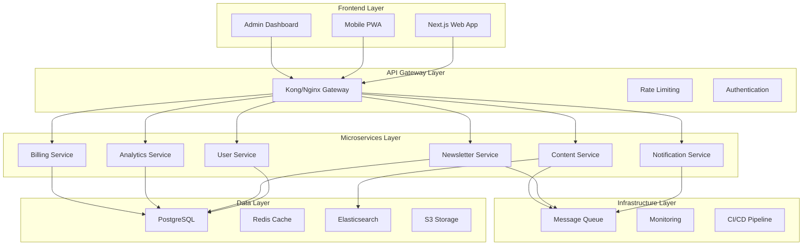

# Design Document

## Overview

This design document outlines the transformation of DatatechtonCRM from a basic newsletter application into a professional, enterprise-grade SaaS platform. The design emphasizes modern architecture patterns, scalability, security, and exceptional user experience while maintaining the core newsletter functionality.

The solution implements a microservices architecture with Next.js frontend, Node.js/Python backend services, event-driven communication, and comprehensive observability. The platform will support advanced personalization, multi-channel distribution, and robust monetization capabilities.

## Architecture

### High-Level Architecture



### Technology Stack

**Frontend:**
- Next.js 14 with App Router
- TypeScript for type safety
- Tailwind CSS for styling
- Framer Motion for animations
- React Query for state management
- PWA capabilities

**Backend Services:**
- Node.js with Express/Fastify
- Python with FastAPI for ML services
- TypeScript/Python for type safety
- Prisma ORM for database operations
- Bull/BullMQ for job queues

**Infrastructure:**
- Docker containers
- Kubernetes orchestration
- AWS/GCP cloud services
- Terraform for IaC
- GitHub Actions for CI/CD

**Data Storage:**
- PostgreSQL for transactional data
- Redis for caching and sessions
- Elasticsearch for search and analytics
- S3 for file storage
- ClickHouse for analytics

## Components and Interfaces

### 1. Frontend Components

#### Next.js Application Structure
```typescript
// app/layout.tsx - Root layout with providers
export default function RootLayout({
  children,
}: {
  children: React.ReactNode
}) {
  return (
    <html lang="en">
      <body>
        <Providers>
          <Navigation />
          {children}
          <Footer />
        </Providers>
      </body>
    </html>
  )
}

// components/dashboard/NewsletterBuilder.tsx
interface NewsletterBuilderProps {
  onSave: (newsletter: Newsletter) => void
  onPreview: (content: string) => void
  templates: Template[]
}

export const NewsletterBuilder: React.FC<NewsletterBuilderProps> = ({
  onSave,
  onPreview,
  templates
}) => {
  // Drag-and-drop newsletter builder implementation
}

// components/analytics/EngagementChart.tsx
interface EngagementChartProps {
  data: EngagementMetrics[]
  timeRange: TimeRange
  onTimeRangeChange: (range: TimeRange) => void
}

export const EngagementChart: React.FC<EngagementChartProps> = ({
  data,
  timeRange,
  onTimeRangeChange
}) => {
  // Interactive analytics charts
}
```

#### Key UI Components
- **Dashboard**: Modern, responsive dashboard with customizable widgets
- **Newsletter Builder**: Drag-and-drop editor with real-time preview
- **Analytics Dashboard**: Interactive charts and metrics visualization
- **Subscriber Management**: Advanced filtering and segmentation tools
- **Settings Panel**: Comprehensive preference management
- **Billing Interface**: Subscription management and payment processing

### 2. Backend Services

#### User Service
```typescript
// services/user/src/controllers/UserController.ts
export class UserController {
  async createUser(req: Request, res: Response) {
    const userData = CreateUserSchema.parse(req.body)
    const user = await this.userService.createUser(userData)
    res.status(201).json(user)
  }

  async updatePreferences(req: Request, res: Response) {
    const { userId } = req.params
    const preferences = UpdatePreferencesSchema.parse(req.body)
    await this.userService.updatePreferences(userId, preferences)
    res.status(200).json({ success: true })
  }
}

// services/user/src/models/User.ts
export interface User {
  id: string
  email: string
  profile: UserProfile
  preferences: UserPreferences
  subscription: Subscription
  createdAt: Date
  updatedAt: Date
}

export interface UserPreferences {
  contentSections: string[]
  frequency: 'daily' | 'weekly' | 'monthly'
  format: 'html' | 'markdown' | 'plain'
  topics: string[]
  sendTime: string
  timezone: string
}
```

#### Newsletter Service
```typescript
// services/newsletter/src/controllers/NewsletterController.ts
export class NewsletterController {
  async generateNewsletter(req: Request, res: Response) {
    const params = GenerateNewsletterSchema.parse(req.body)
    const job = await this.newsletterQueue.add('generate', params)
    res.status(202).json({ jobId: job.id })
  }

  async getNewsletterStatus(req: Request, res: Response) {
    const { jobId } = req.params
    const job = await this.newsletterQueue.getJob(jobId)
    res.json({ status: job?.progress, result: job?.returnvalue })
  }
}

// services/newsletter/src/processors/NewsletterProcessor.ts
export class NewsletterProcessor {
  async processGeneration(job: Job<GenerateNewsletterParams>) {
    const { sections, personalization, userId } = job.data
    
    // Fetch personalized content
    const content = await this.contentService.getPersonalizedContent(
      sections,
      personalization
    )
    
    // Generate newsletter
    const newsletter = await this.templateEngine.render(content, userId)
    
    // Save and distribute
    await this.newsletterService.save(newsletter)
    await this.distributionService.distribute(newsletter)
    
    return newsletter
  }
}
```

#### Content Service
```typescript
// services/content/src/controllers/ContentController.ts
export class ContentController {
  async aggregateContent(req: Request, res: Response) {
    const sources = await this.contentService.getAllSources()
    const aggregationJob = await this.contentQueue.add('aggregate', { sources })
    res.status(202).json({ jobId: aggregationJob.id })
  }

  async searchContent(req: Request, res: Response) {
    const query = SearchQuerySchema.parse(req.query)
    const results = await this.searchService.search(query)
    res.json(results)
  }
}

// services/content/src/processors/ContentAggregator.ts
export class ContentAggregator {
  async aggregateFromSources(sources: ContentSource[]) {
    const aggregationTasks = sources.map(source => 
      this.processSource(source)
    )
    
    const results = await Promise.allSettled(aggregationTasks)
    
    // Process and score content
    const processedContent = await this.contentProcessor.process(results)
    
    // Store in search index
    await this.searchService.indexContent(processedContent)
    
    return processedContent
  }
}
```

#### CRM Service
```typescript
// services/crm/src/controllers/CRMController.ts
export class CRMController {
  async createContact(req: Request, res: Response) {
    const contactData = CreateContactSchema.parse(req.body)
    const contact = await this.crmService.createContact(contactData)
    res.status(201).json(contact)
  }

  async getContactJourney(req: Request, res: Response) {
    const { contactId } = req.params
    const journey = await this.crmService.getContactJourney(contactId)
    res.json(journey)
  }

  async createSegment(req: Request, res: Response) {
    const segmentData = CreateSegmentSchema.parse(req.body)
    const segment = await this.crmService.createSegment(segmentData)
    res.status(201).json(segment)
  }

  async runAutomation(req: Request, res: Response) {
    const automationData = RunAutomationSchema.parse(req.body)
    const job = await this.automationQueue.add('run', automationData)
    res.status(202).json({ jobId: job.id })
  }
}

// services/crm/src/models/Contact.ts
export interface Contact {
  id: string
  email: string
  firstName?: string
  lastName?: string
  company?: string
  jobTitle?: string
  phone?: string
  customFields: Record<string, any>
  tags: string[]
  leadScore: number
  lifecycle: 'subscriber' | 'lead' | 'customer' | 'evangelist'
  source: string
  engagementHistory: EngagementEvent[]
  preferences: ContactPreferences
  createdAt: Date
  updatedAt: Date
}

export interface EngagementEvent {
  id: string
  type: 'email_open' | 'email_click' | 'website_visit' | 'form_submit' | 'purchase'
  timestamp: Date
  metadata: Record<string, any>
  score: number
}

export interface ContactPreferences {
  emailFrequency: 'daily' | 'weekly' | 'monthly'
  contentTypes: string[]
  communicationChannels: string[]
  timezone: string
  language: string
}
```

#### Marketing Automation Service
```typescript
// services/automation/src/controllers/AutomationController.ts
export class AutomationController {
  async createWorkflow(req: Request, res: Response) {
    const workflowData = CreateWorkflowSchema.parse(req.body)
    const workflow = await this.automationService.createWorkflow(workflowData)
    res.status(201).json(workflow)
  }

  async triggerWorkflow(req: Request, res: Response) {
    const { workflowId } = req.params
    const triggerData = TriggerWorkflowSchema.parse(req.body)
    const execution = await this.automationService.triggerWorkflow(workflowId, triggerData)
    res.status(202).json(execution)
  }
}

// services/automation/src/models/Workflow.ts
export interface Workflow {
  id: string
  name: string
  description: string
  trigger: WorkflowTrigger
  steps: WorkflowStep[]
  status: 'active' | 'paused' | 'draft'
  metrics: WorkflowMetrics
  createdAt: Date
  updatedAt: Date
}

export interface WorkflowTrigger {
  type: 'event' | 'schedule' | 'manual'
  conditions: TriggerCondition[]
  settings: Record<string, any>
}

export interface WorkflowStep {
  id: string
  type: 'email' | 'wait' | 'condition' | 'webhook' | 'tag' | 'score'
  config: StepConfig
  nextSteps: string[]
}

export interface DrippCampaign {
  id: string
  name: string
  emails: DripEmail[]
  trigger: CampaignTrigger
  status: 'active' | 'paused' | 'completed'
  metrics: CampaignMetrics
}

export interface DripEmail {
  id: string
  subject: string
  content: string
  delay: number // hours after previous email or trigger
  conditions?: EmailCondition[]
}
```

#### Advanced Newsletter Features Service
```typescript
// services/newsletter-advanced/src/controllers/AdvancedNewsletterController.ts
export class AdvancedNewsletterController {
  async createTemplate(req: Request, res: Response) {
    const templateData = CreateTemplateSchema.parse(req.body)
    const template = await this.templateService.createTemplate(templateData)
    res.status(201).json(template)
  }

  async runABTest(req: Request, res: Response) {
    const testData = CreateABTestSchema.parse(req.body)
    const test = await this.abTestService.createTest(testData)
    res.status(201).json(test)
  }

  async scheduleNewsletter(req: Request, res: Response) {
    const scheduleData = ScheduleNewsletterSchema.parse(req.body)
    const job = await this.schedulerService.scheduleNewsletter(scheduleData)
    res.status(202).json({ jobId: job.id })
  }

  async getDeliverabilityReport(req: Request, res: Response) {
    const { newsletterId } = req.params
    const report = await this.deliverabilityService.getReport(newsletterId)
    res.json(report)
  }
}

// Advanced Newsletter Models
export interface NewsletterTemplate {
  id: string
  name: string
  category: 'business' | 'tech' | 'creative' | 'minimal'
  html: string
  css: string
  variables: TemplateVariable[]
  previewImage: string
  isPublic: boolean
  createdBy: string
}

export interface TemplateVariable {
  name: string
  type: 'text' | 'image' | 'color' | 'boolean'
  defaultValue: any
  description: string
}

export interface ABTest {
  id: string
  name: string
  type: 'subject' | 'content' | 'send_time' | 'template'
  variants: ABTestVariant[]
  trafficSplit: number[] // percentage for each variant
  winnerCriteria: 'open_rate' | 'click_rate' | 'conversion_rate'
  status: 'running' | 'completed' | 'paused'
  results?: ABTestResults
}

export interface ABTestVariant {
  id: string
  name: string
  content: any
  metrics: VariantMetrics
}

export interface DeliverabilityReport {
  newsletterId: string
  deliveryRate: number
  bounceRate: number
  spamRate: number
  reputationScore: number
  domainReputation: Record<string, number>
  recommendations: string[]
  detailedMetrics: DeliverabilityMetrics
}
```
```

### 3. API Gateway Configuration

```yaml
# kong.yml - API Gateway configuration
_format_version: "3.0"

services:
  - name: user-service
    url: http://user-service:3001
    routes:
      - name: user-routes
        paths: ["/api/v1/users"]
        methods: ["GET", "POST", "PUT", "DELETE"]
        plugins:
          - name: rate-limiting
            config:
              minute: 100
              hour: 1000
          - name: jwt
            config:
              secret_is_base64: false

  - name: newsletter-service
    url: http://newsletter-service:3002
    routes:
      - name: newsletter-routes
        paths: ["/api/v1/newsletters"]
        methods: ["GET", "POST", "PUT", "DELETE"]
        plugins:
          - name: rate-limiting
            config:
              minute: 50
              hour: 500
```

## Data Models

### Core Data Models

```typescript
// User and Authentication Models
interface User {
  id: string
  email: string
  passwordHash?: string
  profile: UserProfile
  preferences: UserPreferences
  subscription: Subscription
  engagementMetrics: EngagementMetrics
  createdAt: Date
  updatedAt: Date
}

interface UserProfile {
  firstName: string
  lastName: string
  avatar?: string
  timezone: string
  language: string
  company?: string
  role?: string
}

interface Subscription {
  id: string
  userId: string
  plan: SubscriptionPlan
  status: 'active' | 'cancelled' | 'past_due' | 'trialing'
  currentPeriodStart: Date
  currentPeriodEnd: Date
  cancelAtPeriodEnd: boolean
  stripeSubscriptionId?: string
}

// CRM Models
interface Contact {
  id: string
  email: string
  firstName?: string
  lastName?: string
  company?: string
  jobTitle?: string
  phone?: string
  customFields: Record<string, any>
  tags: string[]
  leadScore: number
  lifecycle: 'subscriber' | 'lead' | 'customer' | 'evangelist'
  source: string
  engagementHistory: EngagementEvent[]
  preferences: ContactPreferences
  segments: string[]
  createdAt: Date
  updatedAt: Date
}

interface Segment {
  id: string
  name: string
  description: string
  conditions: SegmentCondition[]
  contactCount: number
  isAutoUpdating: boolean
  createdAt: Date
  updatedAt: Date
}

interface SegmentCondition {
  field: string
  operator: 'equals' | 'contains' | 'greater_than' | 'less_than' | 'in' | 'not_in'
  value: any
  logicalOperator?: 'AND' | 'OR'
}

interface LeadScoringRule {
  id: string
  name: string
  trigger: ScoringTrigger
  points: number
  isActive: boolean
}

interface ScoringTrigger {
  type: 'email_open' | 'email_click' | 'website_visit' | 'form_submit' | 'tag_added'
  conditions: Record<string, any>
}

// Newsletter Models
interface Newsletter {
  id: string
  title: string
  content: NewsletterContent
  template: Template
  status: 'draft' | 'scheduled' | 'sent' | 'failed'
  scheduledAt?: Date
  sentAt?: Date
  metrics: NewsletterMetrics
  abTest?: ABTest
  segments: string[] // Target segments
  personalization: PersonalizationSettings
  deliverabilitySettings: DeliverabilitySettings
  createdBy: string
  createdAt: Date
}

interface NewsletterContent {
  sections: ContentSection[]
  personalization: PersonalizationData
  metadata: ContentMetadata
  dynamicContent: DynamicContentBlock[]
}

interface DynamicContentBlock {
  id: string
  name: string
  conditions: ContentCondition[]
  variants: ContentVariant[]
}

interface ContentCondition {
  field: string
  operator: string
  value: any
}

interface ContentVariant {
  id: string
  content: string
  isDefault: boolean
}

interface ContentSection {
  id: string
  type: 'news' | 'research' | 'github' | 'events' | 'products' | 'custom'
  title: string
  items: ContentItem[]
  order: number
  isPersonalized: boolean
  displayRules?: DisplayRule[]
}

interface DisplayRule {
  condition: string
  action: 'show' | 'hide' | 'highlight'
}

interface ContentItem {
  id: string
  title: string
  summary: string
  url: string
  source: string
  publishedAt: Date
  score: number
  tags: string[]
  sentiment: number
  readingTime: number
  difficulty: 'beginner' | 'intermediate' | 'advanced'
  category: string
}

// Marketing Automation Models
interface Workflow {
  id: string
  name: string
  description: string
  trigger: WorkflowTrigger
  steps: WorkflowStep[]
  status: 'active' | 'paused' | 'draft'
  metrics: WorkflowMetrics
  createdAt: Date
  updatedAt: Date
}

interface WorkflowTrigger {
  type: 'event' | 'schedule' | 'manual' | 'api'
  conditions: TriggerCondition[]
  settings: Record<string, any>
}

interface WorkflowStep {
  id: string
  type: 'email' | 'wait' | 'condition' | 'webhook' | 'tag' | 'score' | 'segment'
  config: StepConfig
  nextSteps: string[]
  position: { x: number; y: number }
}

interface EmailCampaign {
  id: string
  name: string
  type: 'broadcast' | 'drip' | 'triggered'
  emails: CampaignEmail[]
  trigger?: CampaignTrigger
  status: 'active' | 'paused' | 'completed' | 'draft'
  metrics: CampaignMetrics
  targetSegments: string[]
}

interface CampaignEmail {
  id: string
  subject: string
  preheader: string
  content: string
  template: string
  delay?: number // for drip campaigns
  conditions?: EmailCondition[]
  abTest?: ABTest
}

// Analytics Models
interface EngagementMetrics {
  opens: number
  clicks: number
  unsubscribes: number
  bounces: number
  complaints: number
  engagementScore: number
  lastEngagement: Date
}

interface NewsletterMetrics {
  sent: number
  delivered: number
  opens: number
  uniqueOpens: number
  clicks: number
  uniqueClicks: number
  unsubscribes: number
  bounces: number
  openRate: number
  clickRate: number
  unsubscribeRate: number
}
```

### Database Schema

```sql
-- PostgreSQL Schema
CREATE TABLE users (
  id UUID PRIMARY KEY DEFAULT gen_random_uuid(),
  email VARCHAR(255) UNIQUE NOT NULL,
  password_hash VARCHAR(255),
  profile JSONB NOT NULL DEFAULT '{}',
  preferences JSONB NOT NULL DEFAULT '{}',
  engagement_metrics JSONB NOT NULL DEFAULT '{}',
  created_at TIMESTAMP WITH TIME ZONE DEFAULT NOW(),
  updated_at TIMESTAMP WITH TIME ZONE DEFAULT NOW()
);

CREATE TABLE subscriptions (
  id UUID PRIMARY KEY DEFAULT gen_random_uuid(),
  user_id UUID REFERENCES users(id) ON DELETE CASCADE,
  plan VARCHAR(50) NOT NULL,
  status VARCHAR(20) NOT NULL,
  current_period_start TIMESTAMP WITH TIME ZONE,
  current_period_end TIMESTAMP WITH TIME ZONE,
  cancel_at_period_end BOOLEAN DEFAULT FALSE,
  stripe_subscription_id VARCHAR(255),
  created_at TIMESTAMP WITH TIME ZONE DEFAULT NOW(),
  updated_at TIMESTAMP WITH TIME ZONE DEFAULT NOW()
);

-- CRM Tables
CREATE TABLE contacts (
  id UUID PRIMARY KEY DEFAULT gen_random_uuid(),
  email VARCHAR(255) UNIQUE NOT NULL,
  first_name VARCHAR(100),
  last_name VARCHAR(100),
  company VARCHAR(255),
  job_title VARCHAR(255),
  phone VARCHAR(50),
  custom_fields JSONB NOT NULL DEFAULT '{}',
  tags TEXT[],
  lead_score INTEGER DEFAULT 0,
  lifecycle VARCHAR(20) DEFAULT 'subscriber',
  source VARCHAR(100),
  preferences JSONB NOT NULL DEFAULT '{}',
  created_at TIMESTAMP WITH TIME ZONE DEFAULT NOW(),
  updated_at TIMESTAMP WITH TIME ZONE DEFAULT NOW()
);

CREATE TABLE segments (
  id UUID PRIMARY KEY DEFAULT gen_random_uuid(),
  name VARCHAR(255) NOT NULL,
  description TEXT,
  conditions JSONB NOT NULL,
  contact_count INTEGER DEFAULT 0,
  is_auto_updating BOOLEAN DEFAULT TRUE,
  created_at TIMESTAMP WITH TIME ZONE DEFAULT NOW(),
  updated_at TIMESTAMP WITH TIME ZONE DEFAULT NOW()
);

CREATE TABLE contact_segments (
  contact_id UUID REFERENCES contacts(id) ON DELETE CASCADE,
  segment_id UUID REFERENCES segments(id) ON DELETE CASCADE,
  added_at TIMESTAMP WITH TIME ZONE DEFAULT NOW(),
  PRIMARY KEY (contact_id, segment_id)
);

CREATE TABLE engagement_events (
  id UUID PRIMARY KEY DEFAULT gen_random_uuid(),
  contact_id UUID REFERENCES contacts(id) ON DELETE CASCADE,
  event_type VARCHAR(50) NOT NULL,
  timestamp TIMESTAMP WITH TIME ZONE DEFAULT NOW(),
  metadata JSONB NOT NULL DEFAULT '{}',
  score INTEGER DEFAULT 0,
  newsletter_id UUID,
  campaign_id UUID
);

CREATE TABLE lead_scoring_rules (
  id UUID PRIMARY KEY DEFAULT gen_random_uuid(),
  name VARCHAR(255) NOT NULL,
  trigger JSONB NOT NULL,
  points INTEGER NOT NULL,
  is_active BOOLEAN DEFAULT TRUE,
  created_at TIMESTAMP WITH TIME ZONE DEFAULT NOW()
);

-- Marketing Automation Tables
CREATE TABLE workflows (
  id UUID PRIMARY KEY DEFAULT gen_random_uuid(),
  name VARCHAR(255) NOT NULL,
  description TEXT,
  trigger JSONB NOT NULL,
  steps JSONB NOT NULL DEFAULT '[]',
  status VARCHAR(20) DEFAULT 'draft',
  metrics JSONB NOT NULL DEFAULT '{}',
  created_by UUID REFERENCES users(id),
  created_at TIMESTAMP WITH TIME ZONE DEFAULT NOW(),
  updated_at TIMESTAMP WITH TIME ZONE DEFAULT NOW()
);

CREATE TABLE workflow_executions (
  id UUID PRIMARY KEY DEFAULT gen_random_uuid(),
  workflow_id UUID REFERENCES workflows(id) ON DELETE CASCADE,
  contact_id UUID REFERENCES contacts(id) ON DELETE CASCADE,
  current_step VARCHAR(50),
  status VARCHAR(20) DEFAULT 'running',
  started_at TIMESTAMP WITH TIME ZONE DEFAULT NOW(),
  completed_at TIMESTAMP WITH TIME ZONE,
  metadata JSONB NOT NULL DEFAULT '{}'
);

CREATE TABLE email_campaigns (
  id UUID PRIMARY KEY DEFAULT gen_random_uuid(),
  name VARCHAR(255) NOT NULL,
  type VARCHAR(20) NOT NULL, -- broadcast, drip, triggered
  emails JSONB NOT NULL DEFAULT '[]',
  trigger JSONB,
  status VARCHAR(20) DEFAULT 'draft',
  metrics JSONB NOT NULL DEFAULT '{}',
  target_segments UUID[],
  created_by UUID REFERENCES users(id),
  created_at TIMESTAMP WITH TIME ZONE DEFAULT NOW(),
  updated_at TIMESTAMP WITH TIME ZONE DEFAULT NOW()
);

-- Enhanced Newsletter Tables
CREATE TABLE newsletters (
  id UUID PRIMARY KEY DEFAULT gen_random_uuid(),
  title VARCHAR(255) NOT NULL,
  content JSONB NOT NULL,
  template_id UUID REFERENCES templates(id),
  status VARCHAR(20) NOT NULL DEFAULT 'draft',
  scheduled_at TIMESTAMP WITH TIME ZONE,
  sent_at TIMESTAMP WITH TIME ZONE,
  metrics JSONB NOT NULL DEFAULT '{}',
  ab_test JSONB,
  segments UUID[],
  personalization JSONB NOT NULL DEFAULT '{}',
  deliverability_settings JSONB NOT NULL DEFAULT '{}',
  created_by UUID REFERENCES users(id),
  created_at TIMESTAMP WITH TIME ZONE DEFAULT NOW(),
  updated_at TIMESTAMP WITH TIME ZONE DEFAULT NOW()
);

CREATE TABLE newsletter_templates (
  id UUID PRIMARY KEY DEFAULT gen_random_uuid(),
  name VARCHAR(255) NOT NULL,
  category VARCHAR(50),
  html TEXT NOT NULL,
  css TEXT,
  variables JSONB NOT NULL DEFAULT '[]',
  preview_image VARCHAR(500),
  is_public BOOLEAN DEFAULT FALSE,
  created_by UUID REFERENCES users(id),
  created_at TIMESTAMP WITH TIME ZONE DEFAULT NOW(),
  updated_at TIMESTAMP WITH TIME ZONE DEFAULT NOW()
);

CREATE TABLE ab_tests (
  id UUID PRIMARY KEY DEFAULT gen_random_uuid(),
  name VARCHAR(255) NOT NULL,
  type VARCHAR(20) NOT NULL, -- subject, content, send_time, template
  variants JSONB NOT NULL,
  traffic_split INTEGER[] NOT NULL,
  winner_criteria VARCHAR(20) NOT NULL,
  status VARCHAR(20) DEFAULT 'draft',
  results JSONB,
  newsletter_id UUID REFERENCES newsletters(id),
  created_at TIMESTAMP WITH TIME ZONE DEFAULT NOW(),
  updated_at TIMESTAMP WITH TIME ZONE DEFAULT NOW()
);

CREATE TABLE content_items (
  id UUID PRIMARY KEY DEFAULT gen_random_uuid(),
  title VARCHAR(500) NOT NULL,
  summary TEXT,
  url VARCHAR(1000) NOT NULL,
  source VARCHAR(255) NOT NULL,
  published_at TIMESTAMP WITH TIME ZONE,
  score DECIMAL(3,2) DEFAULT 0,
  tags TEXT[],
  sentiment DECIMAL(3,2),
  reading_time INTEGER, -- in minutes
  difficulty VARCHAR(20), -- beginner, intermediate, advanced
  category VARCHAR(100),
  content_hash VARCHAR(64) UNIQUE,
  created_at TIMESTAMP WITH TIME ZONE DEFAULT NOW()
);

CREATE TABLE deliverability_reports (
  id UUID PRIMARY KEY DEFAULT gen_random_uuid(),
  newsletter_id UUID REFERENCES newsletters(id),
  delivery_rate DECIMAL(5,2),
  bounce_rate DECIMAL(5,2),
  spam_rate DECIMAL(5,2),
  reputation_score DECIMAL(3,2),
  domain_reputation JSONB NOT NULL DEFAULT '{}',
  recommendations TEXT[],
  detailed_metrics JSONB NOT NULL DEFAULT '{}',
  created_at TIMESTAMP WITH TIME ZONE DEFAULT NOW()
);

-- Indexes for performance
CREATE INDEX idx_users_email ON users(email);
CREATE INDEX idx_subscriptions_user_id ON subscriptions(user_id);
CREATE INDEX idx_contacts_email ON contacts(email);
CREATE INDEX idx_contacts_lifecycle ON contacts(lifecycle);
CREATE INDEX idx_contacts_lead_score ON contacts(lead_score DESC);
CREATE INDEX idx_contacts_tags ON contacts USING GIN(tags);
CREATE INDEX idx_segments_auto_updating ON segments(is_auto_updating);
CREATE INDEX idx_engagement_events_contact_id ON engagement_events(contact_id);
CREATE INDEX idx_engagement_events_type ON engagement_events(event_type);
CREATE INDEX idx_engagement_events_timestamp ON engagement_events(timestamp DESC);
CREATE INDEX idx_workflows_status ON workflows(status);
CREATE INDEX idx_workflow_executions_workflow_id ON workflow_executions(workflow_id);
CREATE INDEX idx_workflow_executions_contact_id ON workflow_executions(contact_id);
CREATE INDEX idx_workflow_executions_status ON workflow_executions(status);
CREATE INDEX idx_email_campaigns_type ON email_campaigns(type);
CREATE INDEX idx_email_campaigns_status ON email_campaigns(status);
CREATE INDEX idx_newsletters_status ON newsletters(status);
CREATE INDEX idx_newsletters_created_by ON newsletters(created_by);
CREATE INDEX idx_newsletters_scheduled_at ON newsletters(scheduled_at);
CREATE INDEX idx_newsletter_templates_category ON newsletter_templates(category);
CREATE INDEX idx_newsletter_templates_public ON newsletter_templates(is_public);
CREATE INDEX idx_ab_tests_status ON ab_tests(status);
CREATE INDEX idx_ab_tests_newsletter_id ON ab_tests(newsletter_id);
CREATE INDEX idx_content_items_source ON content_items(source);
CREATE INDEX idx_content_items_published_at ON content_items(published_at);
CREATE INDEX idx_content_items_score ON content_items(score DESC);
CREATE INDEX idx_content_items_category ON content_items(category);
CREATE INDEX idx_content_items_difficulty ON content_items(difficulty);
CREATE INDEX idx_content_items_tags ON content_items USING GIN(tags);
CREATE INDEX idx_deliverability_reports_newsletter_id ON deliverability_reports(newsletter_id);
```

## Error Handling

### Centralized Error Handling Strategy

```typescript
// utils/errors.ts
export class AppError extends Error {
  public readonly statusCode: number
  public readonly isOperational: boolean

  constructor(message: string, statusCode: number, isOperational = true) {
    super(message)
    this.statusCode = statusCode
    this.isOperational = isOperational
    Error.captureStackTrace(this, this.constructor)
  }
}

export class ValidationError extends AppError {
  constructor(message: string) {
    super(message, 400)
  }
}

export class NotFoundError extends AppError {
  constructor(resource: string) {
    super(`${resource} not found`, 404)
  }
}

export class UnauthorizedError extends AppError {
  constructor(message = 'Unauthorized') {
    super(message, 401)
  }
}

// middleware/errorHandler.ts
export const errorHandler = (
  error: Error,
  req: Request,
  res: Response,
  next: NextFunction
) => {
  if (error instanceof AppError) {
    return res.status(error.statusCode).json({
      status: 'error',
      message: error.message,
      ...(process.env.NODE_ENV === 'development' && { stack: error.stack })
    })
  }

  // Log unexpected errors
  logger.error('Unexpected error:', error)

  // Send generic error response
  res.status(500).json({
    status: 'error',
    message: 'Internal server error'
  })
}

// Circuit breaker implementation
export class CircuitBreaker {
  private failures = 0
  private lastFailureTime?: Date
  private state: 'CLOSED' | 'OPEN' | 'HALF_OPEN' = 'CLOSED'

  constructor(
    private threshold: number = 5,
    private timeout: number = 60000
  ) {}

  async execute<T>(operation: () => Promise<T>): Promise<T> {
    if (this.state === 'OPEN') {
      if (Date.now() - this.lastFailureTime!.getTime() > this.timeout) {
        this.state = 'HALF_OPEN'
      } else {
        throw new Error('Circuit breaker is OPEN')
      }
    }

    try {
      const result = await operation()
      this.onSuccess()
      return result
    } catch (error) {
      this.onFailure()
      throw error
    }
  }

  private onSuccess() {
    this.failures = 0
    this.state = 'CLOSED'
  }

  private onFailure() {
    this.failures++
    this.lastFailureTime = new Date()
    
    if (this.failures >= this.threshold) {
      this.state = 'OPEN'
    }
  }
}
```

### Retry Mechanisms

```typescript
// utils/retry.ts
export async function withRetry<T>(
  operation: () => Promise<T>,
  options: {
    maxAttempts?: number
    delay?: number
    backoff?: 'linear' | 'exponential'
    retryCondition?: (error: Error) => boolean
  } = {}
): Promise<T> {
  const {
    maxAttempts = 3,
    delay = 1000,
    backoff = 'exponential',
    retryCondition = () => true
  } = options

  let lastError: Error

  for (let attempt = 1; attempt <= maxAttempts; attempt++) {
    try {
      return await operation()
    } catch (error) {
      lastError = error as Error
      
      if (attempt === maxAttempts || !retryCondition(lastError)) {
        throw lastError
      }

      const waitTime = backoff === 'exponential' 
        ? delay * Math.pow(2, attempt - 1)
        : delay * attempt

      await new Promise(resolve => setTimeout(resolve, waitTime))
    }
  }

  throw lastError!
}
```

## Testing Strategy

### Testing Pyramid Implementation

```typescript
// Unit Tests
// tests/unit/services/UserService.test.ts
describe('UserService', () => {
  let userService: UserService
  let mockRepository: jest.Mocked<UserRepository>

  beforeEach(() => {
    mockRepository = createMockRepository()
    userService = new UserService(mockRepository)
  })

  describe('createUser', () => {
    it('should create user with valid data', async () => {
      const userData = { email: 'test@example.com', password: 'password123' }
      const expectedUser = { id: '123', ...userData }
      
      mockRepository.create.mockResolvedValue(expectedUser)
      
      const result = await userService.createUser(userData)
      
      expect(result).toEqual(expectedUser)
      expect(mockRepository.create).toHaveBeenCalledWith(userData)
    })

    it('should throw ValidationError for invalid email', async () => {
      const userData = { email: 'invalid-email', password: 'password123' }
      
      await expect(userService.createUser(userData))
        .rejects.toThrow(ValidationError)
    })
  })
})

// Integration Tests
// tests/integration/api/users.test.ts
describe('Users API', () => {
  let app: Application
  let testDb: TestDatabase

  beforeAll(async () => {
    testDb = await setupTestDatabase()
    app = createTestApp(testDb)
  })

  afterAll(async () => {
    await testDb.cleanup()
  })

  describe('POST /api/v1/users', () => {
    it('should create user and return 201', async () => {
      const userData = {
        email: 'test@example.com',
        password: 'password123',
        profile: { firstName: 'John', lastName: 'Doe' }
      }

      const response = await request(app)
        .post('/api/v1/users')
        .send(userData)
        .expect(201)

      expect(response.body).toMatchObject({
        id: expect.any(String),
        email: userData.email,
        profile: userData.profile
      })
      expect(response.body.password).toBeUndefined()
    })
  })
})

// E2E Tests
// tests/e2e/newsletter-workflow.test.ts
describe('Newsletter Workflow E2E', () => {
  let page: Page
  let browser: Browser

  beforeAll(async () => {
    browser = await chromium.launch()
    page = await browser.newPage()
  })

  afterAll(async () => {
    await browser.close()
  })

  it('should complete full newsletter creation and sending workflow', async () => {
    // Login
    await page.goto('/login')
    await page.fill('[data-testid=email]', 'admin@example.com')
    await page.fill('[data-testid=password]', 'password123')
    await page.click('[data-testid=login-button]')

    // Navigate to newsletter builder
    await page.click('[data-testid=create-newsletter]')
    
    // Build newsletter
    await page.fill('[data-testid=newsletter-title]', 'Test Newsletter')
    await page.selectOption('[data-testid=template-select]', 'modern')
    await page.check('[data-testid=section-news]')
    await page.check('[data-testid=section-research]')
    
    // Preview and send
    await page.click('[data-testid=preview-button]')
    await page.waitForSelector('[data-testid=preview-content]')
    await page.click('[data-testid=send-button]')
    
    // Verify success
    await expect(page.locator('[data-testid=success-message]'))
      .toContainText('Newsletter sent successfully')
  })
})
```

### Performance Testing

```typescript
// tests/performance/load-test.ts
import { check } from 'k6'
import http from 'k6/http'

export let options = {
  stages: [
    { duration: '2m', target: 100 }, // Ramp up
    { duration: '5m', target: 100 }, // Stay at 100 users
    { duration: '2m', target: 200 }, // Ramp up to 200 users
    { duration: '5m', target: 200 }, // Stay at 200 users
    { duration: '2m', target: 0 },   // Ramp down
  ],
  thresholds: {
    http_req_duration: ['p(95)<500'], // 95% of requests under 500ms
    http_req_failed: ['rate<0.1'],    // Error rate under 10%
  },
}

export default function () {
  // Test newsletter generation endpoint
  let response = http.post('http://api.example.com/api/v1/newsletters/generate', {
    sections: ['news', 'research'],
    task_type: 'daily'
  }, {
    headers: {
      'Authorization': 'Bearer ' + __ENV.API_TOKEN,
      'Content-Type': 'application/json'
    }
  })

  check(response, {
    'status is 202': (r) => r.status === 202,
    'response time < 500ms': (r) => r.timings.duration < 500,
  })
}
```

## Advanced CRM & Newsletter Features

### Missing CRM Features to Implement

#### 1. Contact Management & Segmentation
- **Advanced Contact Profiles**: Custom fields, lead scoring, lifecycle stages, contact history
- **Dynamic Segmentation**: Real-time segments based on behavior, demographics, engagement
- **Contact Import/Export**: CSV, API integrations, bulk operations with validation
- **Duplicate Detection**: Automatic merging and deduplication algorithms
- **Contact Enrichment**: Integration with data providers (Clearbit, ZoomInfo) for profile enhancement

#### 2. Lead Scoring & Qualification
- **Behavioral Scoring**: Points for email opens, clicks, website visits, content downloads
- **Demographic Scoring**: Company size, industry, job title, location-based scoring
- **Engagement Decay**: Time-based score reduction for inactive contacts
- **Custom Scoring Rules**: Flexible rule engine for business-specific scoring criteria
- **Lead Qualification Workflows**: Automated MQL to SQL progression

#### 3. Marketing Automation
- **Visual Workflow Builder**: Drag-and-drop automation designer with conditional logic
- **Trigger-Based Campaigns**: Event-driven automation (signup, purchase, engagement)
- **Drip Campaigns**: Time-based email sequences with branching logic
- **Lead Nurturing**: Multi-touch campaigns based on buyer journey stage
- **Cross-Channel Automation**: Email, SMS, push notifications, social media

#### 4. Advanced Analytics & Reporting
- **Attribution Modeling**: Multi-touch attribution for newsletter conversions
- **Cohort Analysis**: Subscriber behavior analysis over time
- **Predictive Analytics**: Churn prediction, optimal send time, content preferences
- **Revenue Attribution**: Track newsletter impact on sales and revenue
- **Custom Dashboards**: Drag-and-drop dashboard builder with real-time data

### Missing Newsletter Features to Implement

#### 1. Advanced Content Management
- **Content Library**: Centralized repository with tagging, search, and version control
- **Content Blocks**: Reusable components for consistent branding
- **Dynamic Content**: Personalized content based on subscriber data
- **Content Approval Workflow**: Multi-stage review process with comments and approvals
- **Content Performance Tracking**: Individual article/section performance metrics

#### 2. Template & Design System
- **Advanced Template Editor**: Visual editor with custom CSS, responsive design
- **Brand Kit Management**: Colors, fonts, logos, style guidelines
- **Template Marketplace**: Public/private template sharing and marketplace
- **Mobile Optimization**: Automatic mobile-responsive design with preview
- **Dark Mode Support**: Automatic dark mode detection and optimization

#### 3. Deliverability & Compliance
- **Deliverability Monitoring**: Real-time reputation tracking, blacklist monitoring
- **GDPR Compliance**: Consent management, data portability, right to be forgotten
- **CAN-SPAM Compliance**: Automatic compliance checking and enforcement
- **Authentication Setup**: SPF, DKIM, DMARC configuration and monitoring
- **Suppression Management**: Global suppression lists, bounce handling, complaint management

#### 4. Advanced Personalization
- **AI-Powered Recommendations**: Machine learning for content personalization
- **Behavioral Triggers**: Send newsletters based on user actions and preferences
- **Geographic Personalization**: Location-based content and send time optimization
- **Industry-Specific Content**: Vertical-specific content curation and delivery
- **Progressive Profiling**: Gradual data collection through interactive content

#### 5. Multi-Channel Distribution
- **Social Media Integration**: Auto-posting to LinkedIn, Twitter, Facebook
- **Slack/Teams Integration**: Newsletter delivery to team channels
- **RSS Feed Generation**: Automatic RSS feed creation from newsletter content
- **Webhook Distribution**: Custom integrations with third-party platforms
- **Print-Ready Formats**: PDF generation for offline distribution

#### 6. Advanced Testing & Optimization
- **Multivariate Testing**: Test multiple elements simultaneously
- **Send Time Optimization**: AI-powered optimal send time for each subscriber
- **Subject Line Testing**: A/B test subject lines with statistical significance
- **Content Testing**: Test different content variations and layouts
- **Frequency Optimization**: Optimal sending frequency per subscriber

#### 7. Enterprise Features
- **White-Label Solution**: Complete branding customization for agencies
- **Multi-Tenant Architecture**: Separate environments for different clients
- **Advanced Permissions**: Role-based access control with granular permissions
- **API Rate Limiting**: Tiered API access based on subscription plans
- **Enterprise SSO**: SAML, OAuth integration for enterprise authentication

#### 8. Revenue & Monetization
- **Subscription Management**: Freemium, tiered pricing, usage-based billing
- **Sponsored Content**: Native advertising and sponsored newsletter placements
- **Affiliate Marketing**: Built-in affiliate tracking and commission management
- **Premium Content**: Paywall integration for exclusive content
- **Marketplace Integration**: Sell newsletter templates, content, and services

### Integration Ecosystem

#### CRM Integrations
- **Salesforce**: Bi-directional sync, lead qualification, opportunity tracking
- **HubSpot**: Contact sync, workflow triggers, deal attribution
- **Pipedrive**: Lead management, sales pipeline integration
- **Zoho CRM**: Contact management, campaign tracking
- **Custom CRM**: REST API for custom CRM integrations

#### Marketing Tool Integrations
- **Google Analytics**: Enhanced tracking, goal conversion, audience insights
- **Facebook Pixel**: Retargeting, lookalike audiences, conversion tracking
- **Zapier**: 1000+ app integrations through automation platform
- **Segment**: Customer data platform integration for unified profiles
- **Mixpanel**: Advanced event tracking and user behavior analysis

#### E-commerce Integrations
- **Shopify**: Customer sync, purchase behavior, product recommendations
- **WooCommerce**: Order tracking, customer lifecycle, abandoned cart recovery
- **Stripe**: Payment processing, subscription management, revenue tracking
- **PayPal**: Alternative payment processing and subscription handling

This comprehensive design provides a solid foundation for transforming DatatechtonCRM into a professional, enterprise-grade newsletter platform with modern architecture, excellent user experience, and robust business capabilities. The enhanced CRM and newsletter features will position the platform as a complete marketing automation solution.