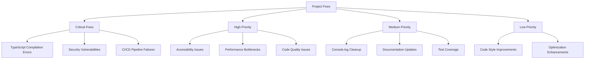
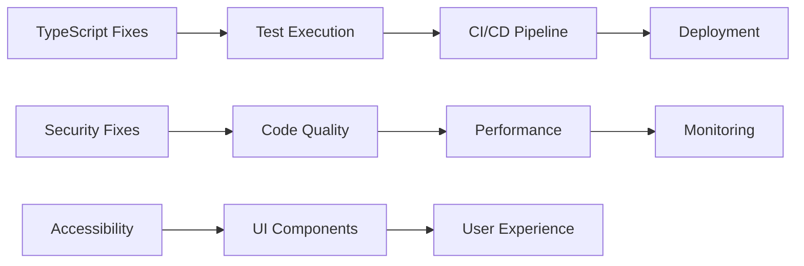

# Design Document

## Overview

This design document outlines the comprehensive approach to fixing critical
issues and implementing improvements across the DataTechton CRM platform. The
solution addresses TypeScript compilation errors, security vulnerabilities,
accessibility compliance, performance optimizations, and code quality
improvements through a systematic, phased approach.

## Architecture

### Fix Categories and Priority



### System Dependencies



## Components and Interfaces

### 1. TypeScript Compilation Fix Component

**Purpose**: Resolve all TypeScript compilation errors to enable test execution
and CI/CD pipeline success

### 1.1 ESLint Configuration Fix Component

**Purpose**: Resolve ESLint configuration and dependency issues causing linting
failures

**Key ESLint Issues to Address**:

- Missing or incompatible ESLint dependencies across services
- Conflicting ESLint configuration between root and service-level configs
- TypeScript ESLint parser configuration issues
- Rule conflicts between different ESLint plugins
- Missing peer dependencies for ESLint plugins
- Inconsistent ESLint versions across the monorepo

**Key TypeScript Issues to Address**:

- Crypto API usage (`createCipherGCM` → `createCipher`)
- AWS SDK type mismatches
- StructuredLogger parameter issues
- Optional property type strictness
- Missing type definitions for custom modules

**ESLint Fix Strategy**:

```bash
# Standardize ESLint dependencies across all services
npm install --save-dev @typescript-eslint/eslint-plugin@latest
npm install --save-dev @typescript-eslint/parser@latest
npm install --save-dev eslint@latest

# Ensure consistent configuration inheritance
# Root .eslintrc.js extends to all service configs
```

**Implementation Strategy**:

```typescript
// Current problematic code
const cipher = crypto.createCipherGCM('aes-256-gcm', key); // ❌ Non-existent method

// Fixed implementation
const cipher = crypto.createCipher('aes-256-gcm', key); // ✅ Correct method
```

### 2. Security Enhancement Component

**Purpose**: Address security vulnerabilities and implement secure coding
practices

**Security Fixes**:

- Replace incorrect crypto methods
- Remove production console.log statements
- Implement proper input validation
- Secure environment variable usage

**Security Patterns**:

```typescript
// Secure crypto implementation
class SecureEncryption {
  private static createSecureCipher(
    algorithm: string,
    key: Buffer
  ): crypto.Cipher {
    return crypto.createCipher(algorithm, key);
  }

  private static createSecureDecipher(
    algorithm: string,
    key: Buffer
  ): crypto.Decipher {
    return crypto.createDecipher(algorithm, key);
  }
}
```

### 3. Accessibility Compliance Component

**Purpose**: Ensure WCAG 2.1 AA compliance across all UI components

**Accessibility Enhancements**:

- ARIA labels and roles
- Keyboard navigation support
- Screen reader compatibility
- Semantic HTML structure
- Loading state announcements

**Component Pattern**:

```typescript
// Accessible component pattern
interface AccessibleComponentProps {
  'aria-label'?: string;
  'aria-describedby'?: string;
  role?: string;
  tabIndex?: number;
}

const AccessibleButton: React.FC<AccessibleComponentProps> = ({
  'aria-label': ariaLabel,
  children,
  ...props
}) => (
  <button
    aria-label={ariaLabel}
    {...props}
  >
    {children}
  </button>
);
```

### 4. Performance Optimization Component

**Purpose**: Implement performance improvements and monitoring

**Performance Strategies**:

- Database query optimization
- Connection pooling
- Multi-level caching
- API response time optimization
- Memory leak prevention

**Caching Architecture**:

```typescript
interface CacheStrategy {
  level: 'application' | 'database' | 'cdn';
  ttl: number;
  invalidationStrategy: 'time-based' | 'event-driven';
}

class PerformanceOptimizer {
  private cacheManager: CacheManager;
  private queryOptimizer: QueryOptimizer;
  private connectionPool: ConnectionPool;
}
```

### 5. Code Quality Enhancement Component

**Purpose**: Improve code maintainability and follow best practices

**Quality Improvements**:

- Return type annotations
- Consistent error handling
- Proper logging implementation
- Test coverage enhancement
- ESLint rule compliance

## Data Models

### Fix Tracking Model

```typescript
interface FixItem {
  id: string;
  category: 'critical' | 'high' | 'medium' | 'low';
  type: 'typescript' | 'security' | 'accessibility' | 'performance' | 'quality';
  description: string;
  files: string[];
  status: 'pending' | 'in-progress' | 'completed' | 'verified';
  priority: number;
  estimatedEffort: number; // hours
  dependencies: string[]; // other fix IDs
}
```

### Component Fix Status

```typescript
interface ComponentFixStatus {
  componentPath: string;
  issues: FixItem[];
  accessibilityScore: number; // 0-100
  performanceScore: number; // 0-100
  securityScore: number; // 0-100
  typeScriptCompliance: boolean;
}
```

## Error Handling

### Centralized Error Management

```typescript
class FixValidationError extends Error {
  constructor(
    public fixId: string,
    public category: string,
    message: string
  ) {
    super(message);
    this.name = 'FixValidationError';
  }
}

class FixManager {
  async validateFix(fix: FixItem): Promise<void> {
    try {
      await this.runTypeScriptCheck();
      await this.runSecurityScan();
      await this.runAccessibilityTest();
    } catch (error) {
      throw new FixValidationError(fix.id, fix.category, error.message);
    }
  }
}
```

### Error Recovery Strategies

1. **TypeScript Errors**: Gradual fixing with temporary type assertions where
   necessary
2. **Security Issues**: Immediate fixes with security testing validation
3. **Accessibility Issues**: Component-by-component fixes with automated testing
4. **Performance Issues**: Incremental optimization with monitoring

## Testing Strategy

### Test Categories

1. **Unit Tests**: Individual fix validation
2. **Integration Tests**: Cross-component fix verification
3. **Accessibility Tests**: WCAG compliance validation
4. **Performance Tests**: Benchmark validation
5. **Security Tests**: Vulnerability scanning

### Testing Implementation

```typescript
// Fix validation test pattern
describe('TypeScript Fixes', () => {
  it('should compile without errors', async () => {
    const result = await runTypeScriptCompiler();
    expect(result.errors).toHaveLength(0);
  });

  it('should pass all tests', async () => {
    const result = await runTestSuite();
    expect(result.success).toBe(true);
  });
});

describe('Security Fixes', () => {
  it('should use correct crypto methods', () => {
    const encryptionService = new EncryptionService();
    expect(() => encryptionService.encrypt('test')).not.toThrow();
  });
});

describe('Accessibility Fixes', () => {
  it('should meet WCAG 2.1 AA standards', async () => {
    const { container } = render(<ComponentUnderTest />);
    const results = await axe(container);
    expect(results).toHaveNoViolations();
  });
});
```

### Automated Testing Pipeline

```yaml
# CI/CD Testing Pipeline
name: Fix Validation
on: [push, pull_request]

jobs:
  typescript-validation:
    runs-on: ubuntu-latest
    steps:
      - name: TypeScript Compilation
        run: npm run type-check

  security-validation:
    runs-on: ubuntu-latest
    steps:
      - name: Security Scan
        run: npm audit && npm run security-scan

  accessibility-validation:
    runs-on: ubuntu-latest
    steps:
      - name: Accessibility Tests
        run: npm run test:accessibility

  performance-validation:
    runs-on: ubuntu-latest
    steps:
      - name: Performance Tests
        run: npm run test:performance
```

## Implementation Phases

### Phase 1: Critical Fixes (Week 1)

- TypeScript compilation errors
- Security vulnerabilities
- CI/CD pipeline failures

### Phase 2: High Priority (Week 2)

- Accessibility compliance
- Performance bottlenecks
- Code quality issues

### Phase 3: Medium Priority (Week 3)

- Console.log cleanup
- Documentation updates
- Test coverage improvements

### Phase 4: Low Priority (Week 4)

- Code style improvements
- Additional optimizations
- Monitoring enhancements

## Monitoring and Validation

### Success Metrics

1. **TypeScript Compliance**: 100% compilation success
2. **Security Score**: 95%+ security scan pass rate
3. **Accessibility Score**: WCAG 2.1 AA compliance (95%+)
4. **Performance Score**: API response times <2s (95th percentile)
5. **Code Quality**: ESLint pass rate 100%

### Monitoring Dashboard

```typescript
interface FixDashboard {
  overallProgress: number; // 0-100%
  categoryProgress: {
    typescript: number;
    security: number;
    accessibility: number;
    performance: number;
    quality: number;
  };
  criticalIssues: number;
  completedFixes: number;
  totalFixes: number;
}
```

## Risk Mitigation

### Technical Risks

1. **Breaking Changes**: Incremental fixes with thorough testing
2. **Performance Regression**: Continuous monitoring and rollback capability
3. **Security Vulnerabilities**: Immediate patching with security validation
4. **Accessibility Regression**: Automated testing in CI/CD pipeline

### Mitigation Strategies

1. **Feature Flags**: Gradual rollout of fixes
2. **Rollback Plan**: Quick revert capability for critical issues
3. **Monitoring**: Real-time alerting for regressions
4. **Testing**: Comprehensive test coverage for all fixes

## Dependencies and Integration

### External Dependencies

- TypeScript compiler and type definitions
- ESLint and accessibility testing tools
- Security scanning tools (npm audit, Snyk)
- Performance testing tools (k6, Lighthouse)
- Monitoring tools (Prometheus, Grafana)

### Integration Points

- CI/CD pipeline integration
- Monitoring system integration
- Documentation system updates
- Development workflow integration

This design provides a comprehensive, systematic approach to addressing all
identified issues while maintaining system stability and ensuring continuous
improvement.
